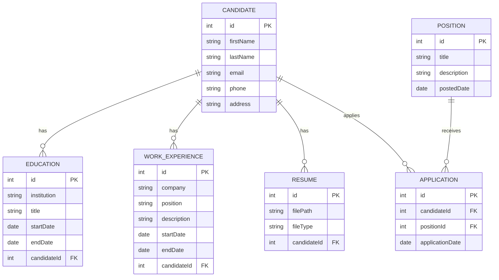

# Modelo de datos de LTI - FELIPE LONDOÑO CARDONA

## PROMPT 1

Quiero que analices este mermaid, por ahora solo quiero que lo revises y analices para tenerlo como contexto, no hagas nada mas.



## RESPONSE 1

He revisado el diagrama Mermaid proporcionado. Aquí está el análisis:

### Entidades y sus Atributos

#### **CANDIDATE**
- `id` (PK)
- `firstName`
- `lastName`
- `email`
- `phone`
- `address`

#### **EDUCATION**
- `id` (PK)
- `institution`
- `title`
- `startDate`
- `endDate`
- `candidateId` (FK)

#### **WORK_EXPERIENCE**
- `id` (PK)
- `company`
- `position`
- `description`
- `startDate`
- `endDate`
- `candidateId` (FK)

#### **RESUME**
- `id` (PK)
- `filePath`
- `fileType`
- `candidateId` (FK)

#### **POSITION**
- `id` (PK)
- `title`
- `description`
- `postedDate`

#### **APPLICATION**
- `id` (PK)
- `candidateId` (FK)
- `positionId` (FK)
- `applicationDate`

---

## Relaciones

1. Un **CANDIDATE** puede tener múltiples **EDUCATION**.
2. Un **CANDIDATE** puede tener múltiples **WORK_EXPERIENCE**.
3. Un **CANDIDATE** puede tener múltiples **RESUME**.
4. Un **CANDIDATE** puede tener múltiples **APPLICATION**.
5. Una **POSITION** puede recibir múltiples **APPLICATION**.

---

## Descripción General

Este diagrama representa las relaciones entre las entidades de un sistema de seguimiento de candidatos, donde:

- Los candidatos pueden tener múltiples experiencias educativas y laborales.
- Los candidatos pueden subir múltiples currículums.
- Los candidatos pueden aplicar a múltiples posiciones.
- Las posiciones pueden recibir múltiples aplicaciones.

---

## PROMPT 2

Eres un experto en administración de base de datos, buenas practicas y desempeño. Tienes muy claro los conceptos de normalización de bases de datos como estas:

### Conceptos de Normalización de Bases de Datos

#### **Primera Forma Normal (1FN)**
- Elimina los valores múltiples de una celda (valores atómicos).  
- Cada registro tiene una clave principal única.  
- Facilita la integridad de los datos al evitar grupos repetidos.  

#### **Segunda Forma Normal (2FN)**
- Cumple la 1FN.  
- Todos los atributos que no son clave dependen completamente de la clave principal.  
- Elimina la redundancia parcial de datos.  

#### **Tercera Forma Normal (3FN)**
- Cumple la 1FN y 2FN.  
- Todos los atributos que no son clave dependen únicamente de la clave principal, no de otros atributos no clave.  
- Elimina dependencias transitivas.  

#### **Forma Normal de Boyce-Codd (FNBC)**
- Cumple la 3FN.  
- Todas las claves candidatas son únicas e identifican de forma única cada registro.  
- Evita ciertas anomalías de actualización.  


### Contexto del Proyecto

#### **Objetivo:**
Crear un script SQL para actualizar la base de datos, incluyendo nuevas entidades y modificaciones a las existentes, que permitan operar el flujo completo de un sistema de seguimiento de candidatos o solicitantes.  

#### **Requerimientos:**
Antes de generar el script SQL, se propone una lista de nuevas entidades y sus atributos para garantizar que el sistema sea mantenible y escalable.  
**Nota:** El script SQL no será entregado en este momento, solo la propuesta de entidades y atributos.

---

## RESPONSE 2

Basado en el análisis del diagrama Mermaid y el contexto proporcionado, aquí está la propuesta de las nuevas entidades y sus atributos para un sistema de seguimiento de candidatos:

## Entidades Existentes

### Candidate
- **id**: Int (PK)
- **firstName**: String
- **lastName**: String
- **email**: String (unique)
- **phone**: String?
- **address**: String?
- **educations**: Education[]
- **workExperiences**: WorkExperience[]
- **resumes**: Resume[]
- **applications**: Application[]

### Education
- **id**: Int (PK)
- **institution**: String
- **title**: String
- **startDate**: DateTime
- **endDate**: DateTime?
- **candidateId**: Int (FK)

### WorkExperience
- **id**: Int (PK)
- **company**: String
- **position**: String
- **description**: String?
- **startDate**: DateTime
- **endDate**: DateTime?
- **candidateId**: Int (FK)

### Resume
- **id**: Int (PK)
- **filePath**: String
- **fileType**: String
- **uploadDate**: DateTime
- **candidateId**: Int (FK)

## Nuevas Entidades

### Position
- **id**: Int (PK)
- **title**: String
- **description**: String
- **postedDate**: DateTime

### Application
- **id**: Int (PK)
- **candidateId**: Int (FK)
- **positionId**: Int (FK)
- **applicationDate**: DateTime

## Relaciones
- Un **Candidate** puede tener múltiples **Education**.
- Un **Candidate** puede tener múltiples **WorkExperience**.
- Un **Candidate** puede tener múltiples **Resume**.
- Un **Candidate** puede tener múltiples **Application**.
- Una **Position** puede recibir múltiples **Application**.

Esta estructura asegura que la base de datos esté normalizada hasta la **3FN** y **FNBC**, eliminando redundancias y asegurando la integridad de los datos.

---

## PROMPT 3

Quiero que el sistema tenga también establecido en su modelo de datos, información que permita saber si la aplicación a una vacante pasó a una segunda instancia, es decir, que se va a programar una entrevista o que fue seleccionado para presentar una prueba, dame opciones

## RESPONSE 3

Para incluir información sobre el estado de una aplicación a una vacante, como si ha pasado a una segunda instancia, se puede agregar una entidad adicional para manejar los estados de las aplicaciones. Aquí hay dos opciones:

## Opción 1: Agregar un campo de estado a la entidad Application
Agregar un campo `status` a la entidad Application para indicar el estado de la aplicación.

### Entidad Application
- **id**: Int (PK)
- **candidateId**: Int (FK)
- **positionId**: Int (FK)
- **applicationDate**: DateTime
- **status**: String (puede ser "applied", "interview_scheduled", "test_scheduled", "selected", etc.)


## Opción 2: Crear una entidad ApplicationStatus
Crear una entidad separada `ApplicationStatus` para manejar los diferentes estados de una aplicación.

### Entidad Application
- **id**: Int (PK)
- **candidateId**: Int (FK)
- **positionId**: Int (FK)
- **applicationDate**: DateTime

### Entidad ApplicationStatus
- **id**: Int (PK)
- **applicationId**: Int (FK)
- **status**: String (puede ser "applied", "interview_scheduled", "test_scheduled", "selected", etc.)
- **statusDate**: DateTime

**Opción 1: Campo de estado en Application**

```prisma
model Application {
  id              Int       @id @default(autoincrement())
  candidateId     Int
  positionId      Int
  applicationDate DateTime
  status          String    @db.VarChar(50)
  candidate       Candidate @relation(fields: [candidateId], references: [id])
  position        Position  @relation(fields: [positionId], references: [id])
}
```

**Opción 2: Entidad ApplicationStatus**

```prisma
model Application {
  id              Int       @id @default(autoincrement())
  candidateId     Int
  positionId      Int
  applicationDate DateTime
  candidate       Candidate @relation(fields: [candidateId], references: [id])
  position        Position  @relation(fields: [positionId], references: [id])
  statuses        ApplicationStatus[]
}

model ApplicationStatus {
  id            Int       @id @default(autoincrement())
  applicationId Int
  status        String    @db.VarChar(50)
  statusDate    DateTime
  application   Application @relation(fields: [applicationId], references: [id])
}
```

## Ejemplo de implementación en Prisma
- **Opción 1**: Campo de estado en Application  
- **Opción 2**: Entidad ApplicationStatus  

Ambas opciones permiten rastrear el estado de una aplicación y manejar diferentes etapas del proceso de selección. La opción 2 proporciona un historial más detallado de los cambios de estado a lo largo del tiempo.

---

## PROMPT 4

Quiero que también exista una entidad que se llame status, que contendrá el nombre y la descripción del estado de la aplicación.

## RESPONSE 4

Para incluir una entidad **Status** que contenga el nombre y la descripción del estado de la aplicación, y relacionarla con la entidad **ApplicationStatus**, aquí está la propuesta:

## Entidades Actualizadas

### Entidad Application

```prisma
model Application {
  id              Int       @id @default(autoincrement())
  candidateId     Int
  positionId      Int
  applicationDate DateTime
  candidate       Candidate @relation(fields: [candidateId], references: [id])
  position        Position  @relation(fields: [positionId], references: [id])
  statuses        ApplicationStatus[]
}
```

### Entidad ApplicationStatus

```prisma
model ApplicationStatus {
  id            Int       @id @default(autoincrement())
  applicationId Int
  statusId      Int
  statusDate    DateTime
  application   Application @relation(fields: [applicationId], references: [id])
  status        Status      @relation(fields: [statusId], references: [id])
}
```

### Nueva Entidad Status

```prisma
model Status {
  id          Int       @id @default(autoincrement())
  name        String    @db.VarChar(50)
  description String?   @db.VarChar(200)
  statuses    ApplicationStatus[]
}
```

---

## Ejemplo Completo en Prisma

```prisma
model Candidate {
  id                Int               @id @default(autoincrement())
  firstName         String            @db.VarChar(100)
  lastName          String            @db.VarChar(100)
  email             String            @unique @db.VarChar(255)
  phone             String?           @db.VarChar(15)
  address           String?           @db.VarChar(100)
  educations        Education[]
  workExperiences   WorkExperience[]
  resumes           Resume[]
  applications      Application[]
}

model Education {
  id            Int       @id @default(autoincrement())
  institution   String    @db.VarChar(100)
  title         String    @db.VarChar(250)
  startDate     DateTime
  endDate       DateTime?
  candidateId   Int
  candidate     Candidate @relation(fields: [candidateId], references: [id])
}

model WorkExperience {
  id          Int       @id @default(autoincrement())
  company     String    @db.VarChar(100)
  position    String    @db.VarChar(100)
  description String?   @db.VarChar(200)
  startDate   DateTime
  endDate     DateTime?
  candidateId Int
  candidate   Candidate @relation(fields: [candidateId], references: [id])
}

model Resume {
  id          Int       @id @default(autoincrement())
  filePath    String    @db.VarChar(500)
  fileType    String    @db.VarChar(50)
  uploadDate  DateTime
  candidateId Int
  candidate   Candidate @relation(fields: [candidateId], references: [id])
}

model Position {
  id          Int       @id @default(autoincrement())
  title       String    @db.VarChar(100)
  description String    @db.VarChar(500)
  postedDate  DateTime
  applications Application[]
}

model Application {
  id              Int       @id @default(autoincrement())
  candidateId     Int
  positionId      Int
  applicationDate DateTime
  candidate       Candidate @relation(fields: [candidateId], references: [id])
  position        Position  @relation(fields: [positionId], references: [id])
  statuses        ApplicationStatus[]
}

model ApplicationStatus {
  id            Int       @id @default(autoincrement())
  applicationId Int
  statusId      Int
  statusDate    DateTime
  application   Application @relation(fields: [applicationId], references: [id])
  status        Status      @relation(fields: [statusId], references: [id])
}

model Status {
  id          Int       @id @default(autoincrement())
  name        String    @db.VarChar(50)
  description String?   @db.VarChar(200)
  statuses    ApplicationStatus[]
}
```

Esta estructura permite rastrear el estado de una aplicación y manejar diferentes etapas del proceso de selección, con una entidad **Status** que contiene el nombre y la descripción de cada estado.

---

## PROMPT 5

Ahora quiero que me entregues el script SQL y expande la estructura de datos usando las migraciones de Prisma.

## RESPONSE 5

Para generar el script SQL y expandir la estructura de datos usando las migraciones de Prisma, sigue estos pasos:


1. Actualiza el archivo `schema.prisma` con las nuevas entidades y relaciones.

```prisma
generator client {
  provider      = "prisma-client-js"
  binaryTargets = ["native", "debian-openssl-3.0.x"]
}

datasource db {
  provider = "postgresql"
  url      = env("DATABASE_URL")
}

model Candidate {
  id                Int               @id @default(autoincrement())
  firstName         String            @db.VarChar(100)
  lastName          String            @db.VarChar(100)
  email             String            @unique @db.VarChar(255)
  phone             String?           @db.VarChar(15)
  address           String?           @db.VarChar(100)
  educations        Education[]
  workExperiences   WorkExperience[]
  resumes           Resume[]
  applications      Application[]
}

model Education {
  id            Int       @id @default(autoincrement())
  institution   String    @db.VarChar(100)
  title         String    @db.VarChar(250)
  startDate     DateTime
  endDate       DateTime?
  candidateId   Int
  candidate     Candidate @relation(fields: [candidateId], references: [id])
}

model WorkExperience {
  id          Int       @id @default(autoincrement())
  company     String    @db.VarChar(100)
  position    String    @db.VarChar(100)
  description String?   @db.VarChar(200)
  startDate   DateTime
  endDate     DateTime?
  candidateId Int
  candidate   Candidate @relation(fields: [candidateId], references: [id])
}

model Resume {
  id          Int       @id @default(autoincrement())
  filePath    String    @db.VarChar(500)
  fileType    String    @db.VarChar(50)
  uploadDate  DateTime
  candidateId Int
  candidate   Candidate @relation(fields: [candidateId], references: [id])
}

model Position {
  id          Int       @id @default(autoincrement())
  title       String    @db.VarChar(100)
  description String    @db.VarChar(500)
  postedDate  DateTime
  applications Application[]
}

model Application {
  id              Int       @id @default(autoincrement())
  candidateId     Int
  positionId      Int
  applicationDate DateTime
  candidate       Candidate @relation(fields: [candidateId], references: [id])
  position        Position  @relation(fields: [positionId], references: [id])
  statuses        ApplicationStatus[]
}

model ApplicationStatus {
  id            Int       @id @default(autoincrement())
  applicationId Int
  statusId      Int
  statusDate    DateTime
  application   Application @relation(fields: [applicationId], references: [id])
  status        Status      @relation(fields: [statusId], references: [id])
}

model Status {
  id          Int       @id @default(autoincrement())
  name        String    @db.VarChar(50)
  description String?   @db.VarChar(200)
  statuses    ApplicationStatus[]
}
```

2. Ejecuta las migraciones de Prisma para actualizar la base de datos. Abre una terminal en tu proyecto y ejecuta los siguientes comandos:

```bash
# Inicializa una nueva migración
npx prisma migrate dev --name add_application_status

# Genera el cliente de Prisma
npx prisma generate
```

3. Obtén el script SQL generado por Prisma.

Prisma guarda el script SQL de la migración en la carpeta prisma/migrations. Puedes encontrar el archivo SQL correspondiente a la migración que acabas de crear y revisarlo.

**Ejemplo de script SQL generado**

```sql
-- CreateTable
CREATE TABLE "Candidate" (
    "id" SERIAL PRIMARY KEY,
    "firstName" VARCHAR(100) NOT NULL,
    "lastName" VARCHAR(100) NOT NULL,
    "email" VARCHAR(255) NOT NULL UNIQUE,
    "phone" VARCHAR(15),
    "address" VARCHAR(100)
);

CREATE TABLE "Education" (
    "id" SERIAL PRIMARY KEY,
    "institution" VARCHAR(100) NOT NULL,
    "title" VARCHAR(250) NOT NULL,
    "startDate" TIMESTAMP NOT NULL,
    "endDate" TIMESTAMP,
    "candidateId" INTEGER NOT NULL,
    FOREIGN KEY ("candidateId") REFERENCES "Candidate"("id")
);

CREATE TABLE "WorkExperience" (
    "id" SERIAL PRIMARY KEY,
    "company" VARCHAR(100) NOT NULL,
    "position" VARCHAR(100) NOT NULL,
    "description" VARCHAR(200),
    "startDate" TIMESTAMP NOT NULL,
    "endDate" TIMESTAMP,
    "candidateId" INTEGER NOT NULL,
    FOREIGN KEY ("candidateId") REFERENCES "Candidate"("id")
);

CREATE TABLE "Resume" (
    "id" SERIAL PRIMARY KEY,
    "filePath" VARCHAR(500) NOT NULL,
    "fileType" VARCHAR(50) NOT NULL,
    "uploadDate" TIMESTAMP NOT NULL,
    "candidateId" INTEGER NOT NULL,
    FOREIGN KEY ("candidateId") REFERENCES "Candidate"("id")
);

CREATE TABLE "Position" (
    "id" SERIAL PRIMARY KEY,
    "title" VARCHAR(100) NOT NULL,
    "description" VARCHAR(500) NOT NULL,
    "postedDate" TIMESTAMP NOT NULL
);

CREATE TABLE "Application" (
    "id" SERIAL PRIMARY KEY,
    "candidateId" INTEGER NOT NULL,
    "positionId" INTEGER NOT NULL,
    "applicationDate" TIMESTAMP NOT NULL,
    FOREIGN KEY ("candidateId") REFERENCES "Candidate"("id"),
    FOREIGN KEY ("positionId") REFERENCES "Position"("id")
);

CREATE TABLE "Status" (
    "id" SERIAL PRIMARY KEY,
    "name" VARCHAR(50) NOT NULL,
    "description" VARCHAR(200)
);

CREATE TABLE "ApplicationStatus" (
    "id" SERIAL PRIMARY KEY,
    "applicationId" INTEGER NOT NULL,
    "statusId" INTEGER NOT NULL,
    "statusDate" TIMESTAMP NOT NULL,
    FOREIGN KEY ("applicationId") REFERENCES "Application"("id"),
    FOREIGN KEY ("statusId") REFERENCES "Status"("id")
);
```

Este script SQL crea las tablas necesarias y establece las relaciones entre ellas según el modelo definido en `schema.prisma`.

---

## PROMPT 6

Veo que hizo falta algo en el modelo de datos del sistema y es poder tener una entidad para una organización o empresa que pueda registrarse con el rol de empresa y poder tener empleados (Persona de talento humano) que puedan gestionar todas las postulaciones de los aspirantes, por favor incluye esto siguiendo las buenas practicas de normalización que hemos hablado anteriormente

## RESPONSE 6

Para incluir una entidad para una organización o empresa y permitir que tengan empleados que gestionen las postulaciones de los aspirantes, podemos agregar las siguientes entidades y relaciones:

1. **Organization**: Representa a la empresa u organización.
2. **Employee**: Representa a los empleados de la organización que gestionan las postulaciones.
3. **Role**: Representa los roles de los empleados dentro de la organización (por ejemplo, "HR Manager", "Recruiter").

### Actualización del archivo `schema.prisma`

```prisma
generator client {
  provider      = "prisma-client-js"
  binaryTargets = ["native", "debian-openssl-3.0.x"]
}

datasource db {
  provider = "postgresql"
  url      = env("DATABASE_URL")
}

model Candidate {
  id                Int               @id @default(autoincrement())
  firstName         String            @db.VarChar(100)
  lastName          String            @db.VarChar(100)
  email             String            @unique @db.VarChar(255)
  phone             String?           @db.VarChar(15)
  address           String?           @db.VarChar(100)
  educations        Education[]
  workExperiences   WorkExperience[]
  resumes           Resume[]
  applications      Application[]
}

model Education {
  id            Int       @id @default(autoincrement())
  institution   String    @db.VarChar(100)
  title         String    @db.VarChar(250)
  startDate     DateTime
  endDate       DateTime?
  candidateId   Int
  candidate     Candidate @relation(fields: [candidateId], references: [id])
}

model WorkExperience {
  id          Int       @id @default(autoincrement())
  company     String    @db.VarChar(100)
  position    String    @db.VarChar(100)
  description String?   @db.VarChar(200)
  startDate   DateTime
  endDate     DateTime?
  candidateId Int
  candidate   Candidate @relation(fields: [candidateId], references: [id])
}

model Resume {
  id          Int       @id @default(autoincrement())
  filePath    String    @db.VarChar(500)
  fileType    String    @db.VarChar(50)
  uploadDate  DateTime
  candidateId Int
  candidate   Candidate @relation(fields: [candidateId], references: [id])
}

model Position {
  id          Int       @id @default(autoincrement())
  title       String    @db.VarChar(100)
  description String    @db.VarChar(500)
  postedDate  DateTime
  organizationId Int
  organization Organization @relation(fields: [organizationId], references: [id])
  applications Application[]
}

model Application {
  id              Int       @id @default(autoincrement())
  candidateId     Int
  positionId      Int
  applicationDate DateTime
  candidate       Candidate @relation(fields: [candidateId], references: [id])
  position        Position  @relation(fields: [positionId], references: [id])
  statuses        ApplicationStatus[]
}

model ApplicationStatus {
  id            Int       @id @default(autoincrement())
  applicationId Int
  statusId      Int
  statusDate    DateTime
  application   Application @relation(fields: [applicationId], references: [id])
  status        Status      @relation(fields: [statusId], references: [id])
}

model Status {
  id          Int       @id @default(autoincrement())
  name        String    @db.VarChar(50)
  description String?   @db.VarChar(200)
  statuses    ApplicationStatus[]
}

model Organization {
  id          Int       @id @default(autoincrement())
  name        String    @db.VarChar(100)
  address     String?   @db.VarChar(200)
  employees   Employee[]
  positions   Position[]
}

model Employee {
  id             Int       @id @default(autoincrement())
  firstName      String    @db.VarChar(100)
  lastName       String    @db.VarChar(100)
  email          String    @unique @db.VarChar(255)
  organizationId Int
  roleId         Int
  organization   Organization @relation(fields: [organizationId], references: [id])
  role           Role         @relation(fields: [roleId], references: [id])
}

model Role {
  id          Int       @id @default(autoincrement())
  name        String    @db.VarChar(50)
  description String?   @db.VarChar(200)
  employees   Employee[]
}
```

## Explicación de las nuevas entidades

### Organization
Representa a la empresa u organización.

- **id**: Identificador único de la organización.
- **name**: Nombre de la organización.
- **address**: Dirección de la organización.
- **employees**: Relación con los empleados de la organización.
- **positions**: Relación con las posiciones ofrecidas por la organización.

---

### Employee
Representa a los empleados de la organización.

- **id**: Identificador único del empleado.
- **firstName**: Nombre del empleado.
- **lastName**: Apellido del empleado.
- **email**: Correo electrónico del empleado.
- **organizationId**: Identificador de la organización a la que pertenece el empleado.
- **roleId**: Identificador del rol del empleado dentro de la organización.
- **organization**: Relación con la organización.
- **role**: Relación con el rol del empleado.

---

### Role
Representa los roles de los empleados dentro de la organización.

- **id**: Identificador único del rol.
- **name**: Nombre del rol.
- **description**: Descripción del rol.
- **employees**: Relación con los empleados que tienen este rol.

## Script SQL generado

Prisma guarda el script SQL de la migración en la carpeta `prisma/migrations`. Puedes encontrar el archivo SQL correspondiente a la migración que acabas de crear y revisarlo. 

Aquí hay un ejemplo del script SQL que podría generarse:

```sql
-- CreateTable
CREATE TABLE "Organization" (
    "id" SERIAL PRIMARY KEY,
    "name" VARCHAR(100) NOT NULL,
    "address" VARCHAR(200)
);

CREATE TABLE "Role" (
    "id" SERIAL PRIMARY KEY,
    "name" VARCHAR(50) NOT NULL,
    "description" VARCHAR(200)
);

CREATE TABLE "Employee" (
    "id" SERIAL PRIMARY KEY,
    "firstName" VARCHAR(100) NOT NULL,
    "lastName" VARCHAR(100) NOT NULL,
    "email" VARCHAR(255) NOT NULL UNIQUE,
    "organizationId" INTEGER NOT NULL,
    "roleId" INTEGER NOT NULL,
    FOREIGN KEY ("organizationId") REFERENCES "Organization"("id"),
    FOREIGN KEY ("roleId") REFERENCES "Role"("id")
);

ALTER TABLE "Position" ADD COLUMN "organizationId" INTEGER NOT NULL;
ALTER TABLE "Position" ADD FOREIGN KEY ("organizationId") REFERENCES "Organization"("id");
```

Este script SQL crea las tablas necesarias y establece las relaciones entre ellas según el modelo definido en `schema.prisma`.

---

## PROMPT 7

Basado en lo que hemos visto, que otra entidad crees que es necesaria para la implementación del sistema?

## RESPONSE 7

## Para la implementación de un sistema de seguimiento de candidatos

Además de las entidades ya discutidas, podríamos considerar agregar las siguientes entidades para mejorar la funcionalidad y la gestión del sistema:

### Entidades adicionales
- **Interview**: Para gestionar las entrevistas programadas con los candidatos.
- **Test**: Para gestionar las pruebas que los candidatos deben realizar.
- **Feedback**: Para almacenar retroalimentación sobre los candidatos después de entrevistas o pruebas.

## Propuesta de nuevas entidades

### Entidad Interview

```prisma
model Interview {
  id              Int       @id @default(autoincrement())
  applicationId   Int
  interviewDate   DateTime
  interviewer     String    @db.VarChar(100)
  location        String?   @db.VarChar(200)
  application     Application @relation(fields: [applicationId], references: [id])
}
```

### Entidad Test

```prisma
model Test {
  id              Int       @id @default(autoincrement())
  applicationId   Int
  testDate        DateTime
  testType        String    @db.VarChar(100)
  location        String?   @db.VarChar(200)
  application     Application @relation(fields: [applicationId], references: [id])
}
```

### Entidad Feedback

```prisma
model Feedback {
  id              Int       @id @default(autoincrement())
  applicationId   Int
  feedbackDate    DateTime
  comments        String    @db.VarChar(1000)
  rating          Int
  application     Application @relation(fields: [applicationId], references: [id])
}
```

## Actualización del archivo `schema.prisma`

```prisma
generator client {
  provider      = "prisma-client-js"
  binaryTargets = ["native", "debian-openssl-3.0.x"]
}

datasource db {
  provider = "postgresql"
  url      = env("DATABASE_URL")
}

model Candidate {
  id                Int               @id @default(autoincrement())
  firstName         String            @db.VarChar(100)
  lastName          String            @db.VarChar(100)
  email             String            @unique @db.VarChar(255)
  phone             String?           @db.VarChar(15)
  address           String?           @db.VarChar(100)
  educations        Education[]
  workExperiences   WorkExperience[]
  resumes           Resume[]
  applications      Application[]
}

model Education {
  id            Int       @id @default(autoincrement())
  institution   String    @db.VarChar(100)
  title         String    @db.VarChar(250)
  startDate     DateTime
  endDate       DateTime?
  candidateId   Int
  candidate     Candidate @relation(fields: [candidateId], references: [id])
}

model WorkExperience {
  id          Int       @id @default(autoincrement())
  company     String    @db.VarChar(100)
  position    String    @db.VarChar(100)
  description String?   @db.VarChar(200)
  startDate   DateTime
  endDate     DateTime?
  candidateId Int
  candidate   Candidate @relation(fields: [candidateId], references: [id])
}

model Resume {
  id          Int       @id @default(autoincrement())
  filePath    String    @db.VarChar(500)
  fileType    String    @db.VarChar(50)
  uploadDate  DateTime
  candidateId Int
  candidate   Candidate @relation(fields: [candidateId], references: [id])
}

model Position {
  id          Int       @id @default(autoincrement())
  title       String    @db.VarChar(100)
  description String    @db.VarChar(500)
  postedDate  DateTime
  organizationId Int
  organization Organization @relation(fields: [organizationId], references: [id])
  applications Application[]
}

model Application {
  id              Int       @id @default(autoincrement())
  candidateId     Int
  positionId      Int
  applicationDate DateTime
  candidate       Candidate @relation(fields: [candidateId], references: [id])
  position        Position  @relation(fields: [positionId], references: [id])
  statuses        ApplicationStatus[]
  interviews      Interview[]
  tests           Test[]
  feedbacks       Feedback[]
}

model ApplicationStatus {
  id            Int       @id @default(autoincrement())
  applicationId Int
  statusId      Int
  statusDate    DateTime
  application   Application @relation(fields: [applicationId], references: [id])
  status        Status      @relation(fields: [statusId], references: [id])
}

model Status {
  id          Int       @id @default(autoincrement())
  name        String    @db.VarChar(50)
  description String?   @db.VarChar(200)
  statuses    ApplicationStatus[]
}

model Organization {
  id          Int       @id @default(autoincrement())
  name        String    @db.VarChar(100)
  address     String?   @db.VarChar(200)
  employees   Employee[]
  positions   Position[]
}

model Employee {
  id             Int       @id @default(autoincrement())
  firstName      String    @db.VarChar(100)
  lastName       String    @db.VarChar(100)
  email          String    @unique @db.VarChar(255)
  organizationId Int
  roleId         Int
  organization   Organization @relation(fields: [organizationId], references: [id])
  role           Role         @relation(fields: [roleId], references: [id])
}

model Role {
  id          Int       @id @default(autoincrement())
  name        String    @db.VarChar(50)
  description String?   @db.VarChar(200)
  employees   Employee[]
}

model Interview {
  id              Int       @id @default(autoincrement())
  applicationId   Int
  interviewDate   DateTime
  interviewer     String    @db.VarChar(100)
  location        String?   @db.VarChar(200)
  application     Application @relation(fields: [applicationId], references: [id])
}

model Test {
  id              Int       @id @default(autoincrement())
  applicationId   Int
  testDate        DateTime
  testType        String    @db.VarChar(100)
  location        String?   @db.VarChar(200)
  application     Application @relation(fields: [applicationId], references: [id])
}

model Feedback {
  id              Int       @id @default(autoincrement())
  applicationId   Int
  feedbackDate    DateTime
  comments        String    @db.VarChar(1000)
  rating          Int
  application     Application @relation(fields: [applicationId], references: [id])
}
```

## Ejecutar las migraciones de Prisma

Abre una terminal en tu proyecto y ejecuta los siguientes comandos:

```bash
# Inicializa una nueva migración
npx prisma migrate dev --name add_interview_test_feedback

# Genera el cliente de Prisma
npx prisma generate
```

## Script SQL generado

Prisma guarda el script SQL de la migración en la carpeta `prisma/migrations`. Puedes encontrar el archivo SQL correspondiente a la migración que acabas de crear y revisarlo. 

Aquí hay un ejemplo del script SQL que podría generarse:

```sql
-- CreateTable
CREATE TABLE "Interview" (
    "id" SERIAL PRIMARY KEY,
    "applicationId" INTEGER NOT NULL,
    "interviewDate" TIMESTAMP NOT NULL,
    "interviewer" VARCHAR(100) NOT NULL,
    "location" VARCHAR(200),
    FOREIGN KEY ("applicationId") REFERENCES "Application"("id")
);

CREATE TABLE "Test" (
    "id" SERIAL PRIMARY KEY,
    "applicationId" INTEGER NOT NULL,
    "testDate" TIMESTAMP NOT NULL,
    "testType" VARCHAR(100) NOT NULL,
    "location" VARCHAR(200),
    FOREIGN KEY ("applicationId") REFERENCES "Application"("id")
);

CREATE TABLE "Feedback" (
    "id" SERIAL PRIMARY KEY,
    "applicationId" INTEGER NOT NULL,
    "feedbackDate" TIMESTAMP NOT NULL,
    "comments" VARCHAR(1000) NOT NULL,
    "rating" INTEGER NOT NULL,
    FOREIGN KEY ("applicationId") REFERENCES "Application"("id")
);
```

Este script SQL crea las tablas necesarias y establece las relaciones entre ellas según el modelo definido en `schema.prisma`.

---

## CONCLUSIÓN

Vale, con esto podemos tener como base para el sistema, quiero que me entregues la definición de indices para mejoran el rendimiento de las consultas, partiendo de que el sistema puede llegar a volúmenes grandes de datos, quiero que propongas donde puede ser estratégicamente bien creados los indices para las tablas, incluye esto en el script sql y dame todo completo.

## RESPONSE FINAL

Para mejorar el rendimiento de las consultas en un sistema con grandes volúmenes de datos, es importante definir índices estratégicos en las tablas. Aquí está la propuesta de índices para las tablas del sistema:

### Propuesta de índices

1. **Candidate**: Índice en el campo email para búsquedas rápidas por correo electrónico.
2. **Education**: Índice en el campo candidateId para búsquedas rápidas de las educaciones de un candidato.
3. **WorkExperience**: Índice en el campo candidateId para búsquedas rápidas de las experiencias laborales de un candidato.
4. **Resume**: Índice en el campo candidateId para búsquedas rápidas de los currículums de un candidato.
5. **Position**: Índice en el campo organizationId para búsquedas rápidas de las posiciones de una organización.
6. **Application**: Índices en los campos candidateId y positionId para búsquedas rápidas de las aplicaciones de un candidato y las aplicaciones a una posición.
7. **ApplicationStatus**: Índice en el campo applicationId para búsquedas rápidas de los estados de una aplicación.
8. **Employee**: Índice en el campo organizationId para búsquedas rápidas de los empleados de una organización.

### Script SQL con índices

```sql
-- CreateTable
CREATE TABLE "Candidate" (
    "id" SERIAL PRIMARY KEY,
    "firstName" VARCHAR(100) NOT NULL,
    "lastName" VARCHAR(100) NOT NULL,
    "email" VARCHAR(255) NOT NULL UNIQUE,
    "phone" VARCHAR(15),
    "address" VARCHAR(100)
);

CREATE INDEX idx_candidate_email ON "Candidate" ("email");

CREATE TABLE "Education" (
    "id" SERIAL PRIMARY KEY,
    "institution" VARCHAR(100) NOT NULL,
    "title" VARCHAR(250) NOT NULL,
    "startDate" TIMESTAMP NOT NULL,
    "endDate" TIMESTAMP,
    "candidateId" INTEGER NOT NULL,
    FOREIGN KEY ("candidateId") REFERENCES "Candidate"("id")
);

CREATE INDEX idx_education_candidateId ON "Education" ("candidateId");

CREATE TABLE "WorkExperience" (
    "id" SERIAL PRIMARY KEY,
    "company" VARCHAR(100) NOT NULL,
    "position" VARCHAR(100) NOT NULL,
    "description" VARCHAR(200),
    "startDate" TIMESTAMP NOT NULL,
    "endDate" TIMESTAMP,
    "candidateId" INTEGER NOT NULL,
    FOREIGN KEY ("candidateId") REFERENCES "Candidate"("id")
);

CREATE INDEX idx_workExperience_candidateId ON "WorkExperience" ("candidateId");

CREATE TABLE "Resume" (
    "id" SERIAL PRIMARY KEY,
    "filePath" VARCHAR(500) NOT NULL,
    "fileType" VARCHAR(50) NOT NULL,
    "uploadDate" TIMESTAMP NOT NULL,
    "candidateId" INTEGER NOT NULL,
    FOREIGN KEY ("candidateId") REFERENCES "Candidate"("id")
);

CREATE INDEX idx_resume_candidateId ON "Resume" ("candidateId");

CREATE TABLE "Position" (
    "id" SERIAL PRIMARY KEY,
    "title" VARCHAR(100) NOT NULL,
    "description" VARCHAR(500) NOT NULL,
    "postedDate" TIMESTAMP NOT NULL,
    "organizationId" INTEGER NOT NULL,
    FOREIGN KEY ("organizationId") REFERENCES "Organization"("id")
);

CREATE INDEX idx_position_organizationId ON "Position" ("organizationId");

CREATE TABLE "Application" (
    "id" SERIAL PRIMARY KEY,
    "candidateId" INTEGER NOT NULL,
    "positionId" INTEGER NOT NULL,
    "applicationDate" TIMESTAMP NOT NULL,
    FOREIGN KEY ("candidateId") REFERENCES "Candidate"("id"),
    FOREIGN KEY ("positionId") REFERENCES "Position"("id")
);

CREATE INDEX idx_application_candidateId ON "Application" ("candidateId");
CREATE INDEX idx_application_positionId ON "Application" ("positionId");

CREATE TABLE "Status" (
    "id" SERIAL PRIMARY KEY,
    "name" VARCHAR(50) NOT NULL,
    "description" VARCHAR(200)
);

CREATE TABLE "ApplicationStatus" (
    "id" SERIAL PRIMARY KEY,
    "applicationId" INTEGER NOT NULL,
    "statusId" INTEGER NOT NULL,
    "statusDate" TIMESTAMP NOT NULL,
    FOREIGN KEY ("applicationId") REFERENCES "Application"("id"),
    FOREIGN KEY ("statusId") REFERENCES "Status"("id")
);

CREATE INDEX idx_applicationStatus_applicationId ON "ApplicationStatus" ("applicationId");

CREATE TABLE "Organization" (
    "id" SERIAL PRIMARY KEY,
    "name" VARCHAR(100) NOT NULL,
    "address" VARCHAR(200)
);

CREATE TABLE "Role" (
    "id" SERIAL PRIMARY KEY,
    "name" VARCHAR(50) NOT NULL,
    "description" VARCHAR(200)
);

CREATE TABLE "Employee" (
    "id" SERIAL PRIMARY KEY,
    "firstName" VARCHAR(100) NOT NULL,
    "lastName" VARCHAR(100) NOT NULL,
    "email" VARCHAR(255) NOT NULL UNIQUE,
    "organizationId" INTEGER NOT NULL,
    "roleId" INTEGER NOT NULL,
    FOREIGN KEY ("organizationId") REFERENCES "Organization"("id"),
    FOREIGN KEY ("roleId") REFERENCES "Role"("id")
);

CREATE INDEX idx_employee_organizationId ON "Employee" ("organizationId");

CREATE TABLE "Interview" (
    "id" SERIAL PRIMARY KEY,
    "applicationId" INTEGER NOT NULL,
    "interviewDate" TIMESTAMP NOT NULL,
    "interviewer" VARCHAR(100) NOT NULL,
    "location" VARCHAR(200),
    FOREIGN KEY ("applicationId") REFERENCES "Application"("id")
);

CREATE TABLE "Test" (
    "id" SERIAL PRIMARY KEY,
    "applicationId" INTEGER NOT NULL,
    "testDate" TIMESTAMP NOT NULL,
    "testType" VARCHAR(100) NOT NULL,
    "location" VARCHAR(200),
    FOREIGN KEY ("applicationId") REFERENCES "Application"("id")
);

CREATE TABLE "Feedback" (
    "id" SERIAL PRIMARY KEY,
    "applicationId" INTEGER NOT NULL,
    "feedbackDate" TIMESTAMP NOT NULL,
    "comments" VARCHAR(1000) NOT NULL,
    "rating" INTEGER NOT NULL,
    FOREIGN KEY ("applicationId") REFERENCES "Application"("id")
);
```

Este script SQL crea las tablas necesarias, establece las relaciones entre ellas y define los índices estratégicos para mejorar el rendimiento de las consultas en el sistema.